# Injective Explorer 架构图与流程图

> **文档版本**: v1.0  
> **编写日期**: 2025-01-XX  
> **说明**: 本文档包含系统的架构图和流程图，使用Mermaid语法绘制

---

## 目录

1. [系统架构图](#系统架构图)
2. [数据流图](#数据流图)
3. [核心流程图](#核心流程图)
4. [API管理流程图](#api管理流程图)
5. [部署架构图](#部署架构图)

---

## 系统架构图

### 整体架构

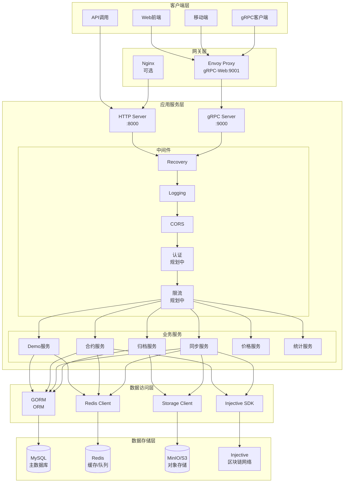
```mermaid
graph TB
    subgraph "客户端层"
        Web[Web前端]
        Mobile[移动端]
        API[API调用]
        gRPC_Client[gRPC客户端]
    end

    subgraph "网关层"
        Envoy[Envoy Proxy<br/>gRPC-Web:9001]
        Nginx[Nginx<br/>可选]
    end

    subgraph "应用服务层"
        HTTP_Server[HTTP Server<br/>:8000]
        gRPC_Server[gRPC Server<br/>:9000]
        
        subgraph "中间件"
            Recovery[Recovery]
            Logging[Logging]
            CORS[CORS]
            Auth[认证<br/>规划中]
            RateLimit[限流<br/>规划中]
        end
        
        subgraph "业务服务"
            Demo[Demo服务]
            Contract[合约服务]
            Sync[同步服务]
            Archive[归档服务]
            Price[价格服务]
            Stats[统计服务]
        end
    end

    subgraph "数据访问层"
        GORM[GORM<br/>ORM]
        Redis_Client[Redis Client]
        Storage_Client[Storage Client]
        Chain_SDK[Injective SDK]
    end

    subgraph "数据存储层"
        MySQL[(MySQL<br/>主数据库)]
        Redis[(Redis<br/>缓存/队列)]
        MinIO[(MinIO/S3<br/>对象存储)]
        Blockchain[Injective<br/>区块链网络]
    end

    Web --> Envoy
    Mobile --> Envoy
    API --> HTTP_Server
    gRPC_Client --> Envoy
    
    Envoy --> gRPC_Server
    Nginx --> HTTP_Server
    
    HTTP_Server --> Recovery
    gRPC_Server --> Recovery
    
    Recovery --> Logging
    Logging --> CORS
    CORS --> Auth
    Auth --> RateLimit
    
    RateLimit --> Demo
    RateLimit --> Contract
    RateLimit --> Sync
    RateLimit --> Archive
    RateLimit --> Price
    RateLimit --> Stats
    
    Demo --> GORM
    Contract --> GORM
    Sync --> GORM
    Archive --> GORM
    
    Demo --> Redis_Client
    Contract --> Redis_Client
    Sync --> Redis_Client
    
    Archive --> Storage_Client
    Sync --> Storage_Client
    
    Contract --> Chain_SDK
    Sync --> Chain_SDK
    
    GORM --> MySQL
    Redis_Client --> Redis
    Storage_Client --> MinIO
    Chain_SDK --> Blockchain
```

### 服务分层架构

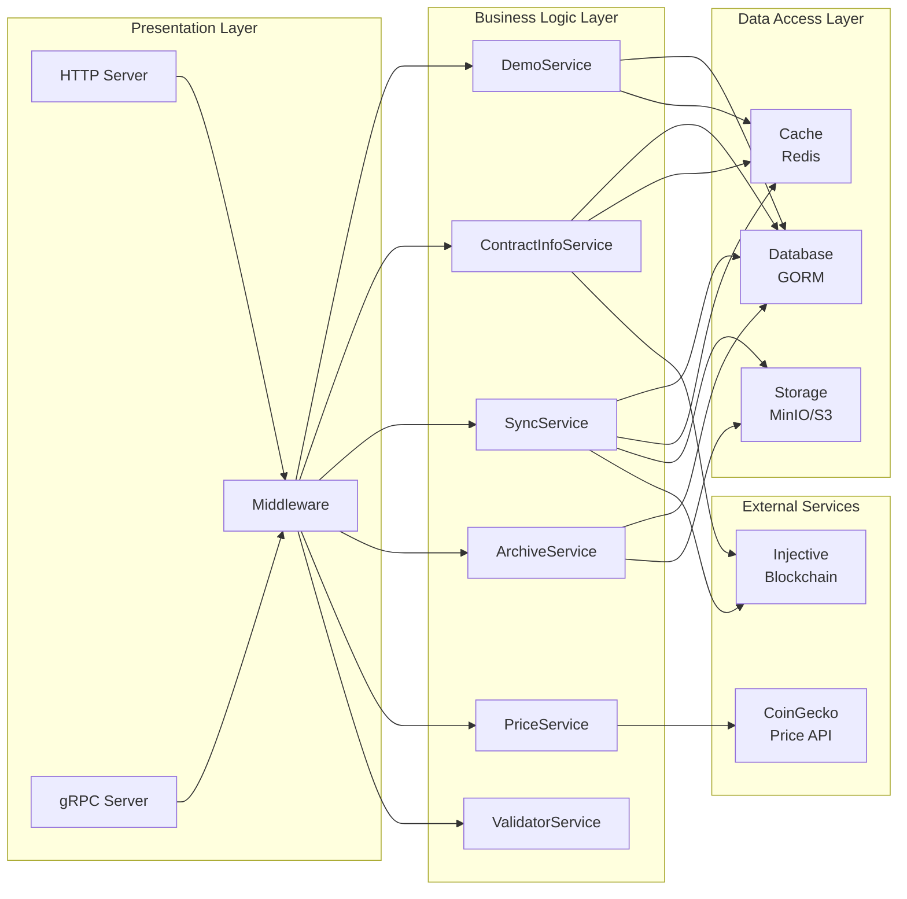
```mermaid
graph LR
    subgraph "Presentation Layer"
        HTTP[HTTP Server]
        gRPC[gRPC Server]
        MW[Middleware]
    end
    
    subgraph "Business Logic Layer"
        BS1[DemoService]
        BS2[ContractInfoService]
        BS3[SyncService]
        BS4[ArchiveService]
        BS5[PriceService]
        BS6[ValidatorService]
    end
    
    subgraph "Data Access Layer"
        DAL1[Database<br/>GORM]
        DAL2[Cache<br/>Redis]
        DAL3[Storage<br/>MinIO/S3]
    end
    
    subgraph "External Services"
        EXT1[Injective<br/>Blockchain]
        EXT2[CoinGecko<br/>Price API]
    end
    
    HTTP --> MW
    gRPC --> MW
    MW --> BS1
    MW --> BS2
    MW --> BS3
    MW --> BS4
    MW --> BS5
    MW --> BS6
    
    BS1 --> DAL1
    BS2 --> DAL1
    BS3 --> DAL1
    BS4 --> DAL1
    
    BS1 --> DAL2
    BS2 --> DAL2
    BS3 --> DAL2
    
    BS4 --> DAL3
    BS3 --> DAL3
    
    BS2 --> EXT1
    BS3 --> EXT1
    BS5 --> EXT2
```

---

## 数据流图

### 区块同步数据流

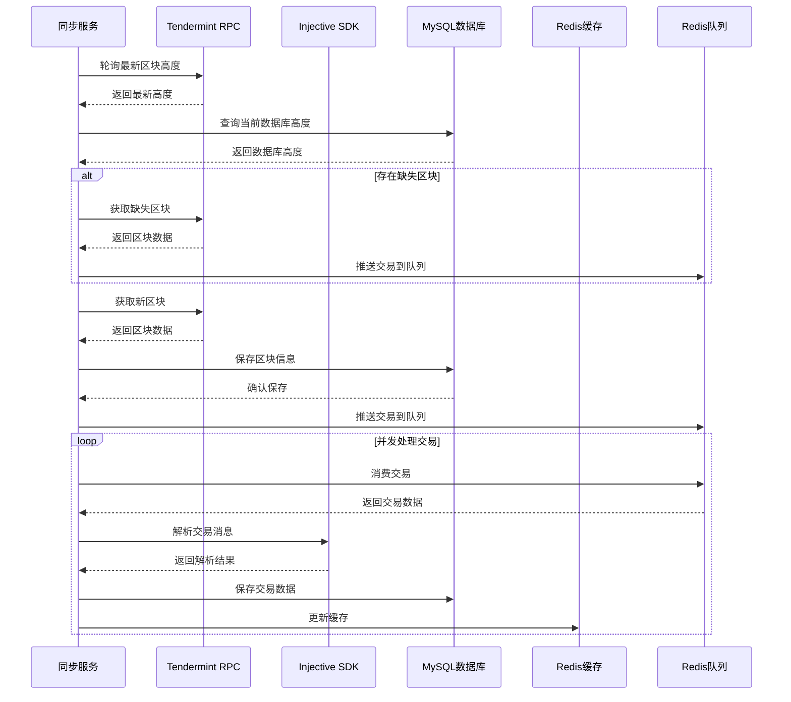
```mermaid
sequenceDiagram
    participant SyncService as 同步服务
    participant TMClient as Tendermint RPC
    participant ChainSDK as Injective SDK
    participant DB as MySQL数据库
    participant Redis as Redis缓存
    participant Queue as Redis队列

    SyncService->>TMClient: 轮询最新区块高度
    TMClient-->>SyncService: 返回最新高度
    
    SyncService->>DB: 查询当前数据库高度
    DB-->>SyncService: 返回数据库高度
    
    alt 存在缺失区块
        SyncService->>TMClient: 获取缺失区块
        TMClient-->>SyncService: 返回区块数据
        SyncService->>Queue: 推送交易到队列
    end
    
    SyncService->>TMClient: 获取新区块
    TMClient-->>SyncService: 返回区块数据
    
    SyncService->>DB: 保存区块信息
    DB-->>SyncService: 确认保存
    
    SyncService->>Queue: 推送交易到队列
    
    loop 并发处理交易
        SyncService->>Queue: 消费交易
        Queue-->>SyncService: 返回交易数据
        SyncService->>ChainSDK: 解析交易消息
        ChainSDK-->>SyncService: 返回解析结果
        SyncService->>DB: 保存交易数据
        SyncService->>Redis: 更新缓存
    end
```

### 交易查询数据流

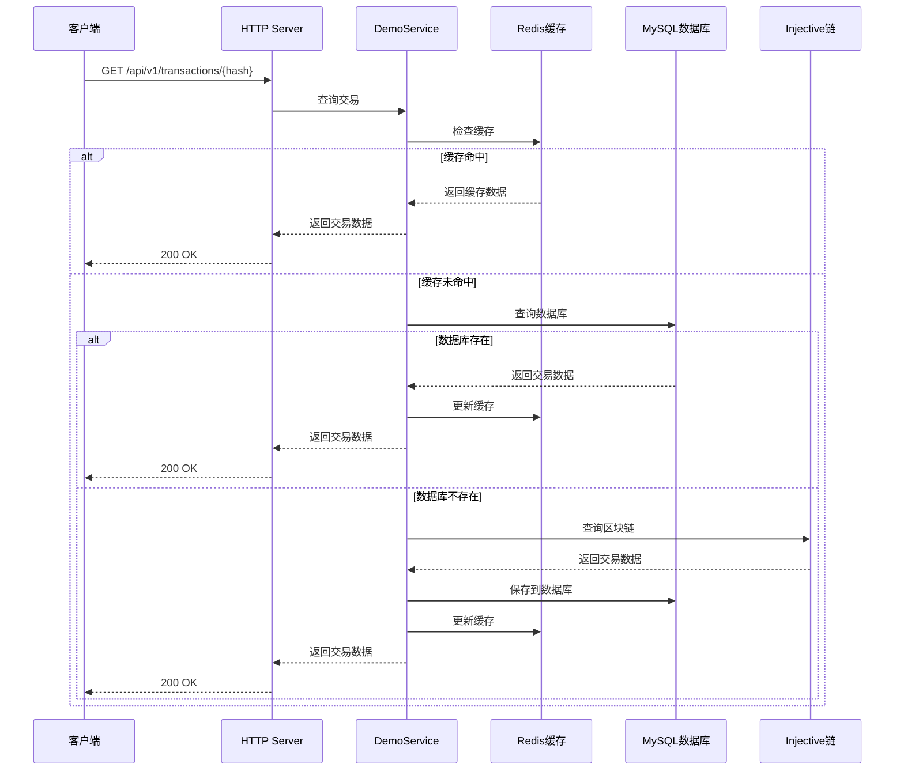
```mermaid
sequenceDiagram
    participant Client as 客户端
    participant HTTP as HTTP Server
    participant Service as DemoService
    participant Redis as Redis缓存
    participant DB as MySQL数据库
    participant Chain as Injective链

    Client->>HTTP: GET /api/v1/transactions/{hash}
    HTTP->>Service: 查询交易
    
    Service->>Redis: 检查缓存
    alt 缓存命中
        Redis-->>Service: 返回缓存数据
        Service-->>HTTP: 返回交易数据
        HTTP-->>Client: 200 OK
    else 缓存未命中
        Service->>DB: 查询数据库
        alt 数据库存在
            DB-->>Service: 返回交易数据
            Service->>Redis: 更新缓存
            Service-->>HTTP: 返回交易数据
            HTTP-->>Client: 200 OK
        else 数据库不存在
            Service->>Chain: 查询区块链
            Chain-->>Service: 返回交易数据
            Service->>DB: 保存到数据库
            Service->>Redis: 更新缓存
            Service-->>HTTP: 返回交易数据
            HTTP-->>Client: 200 OK
        end
    end
```

---

## 核心流程图

### 区块同步流程

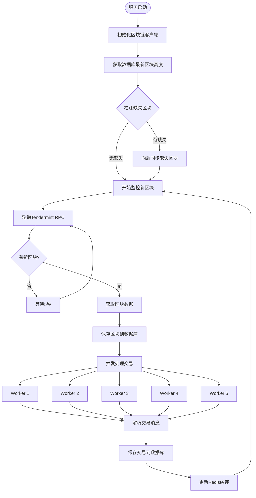
```mermaid
flowchart TD
    Start([服务启动]) --> Init[初始化区块链客户端]
    Init --> GetDBHeight[获取数据库最新区块高度]
    GetDBHeight --> CheckGaps{检测缺失区块}
    
    CheckGaps -->|有缺失| BackwardSync[向后同步缺失区块]
    CheckGaps -->|无缺失| Monitor[开始监控新区块]
    
    BackwardSync --> Monitor
    
    Monitor --> Poll[轮询Tendermint RPC]
    Poll --> HasNewBlock{有新区块?}
    
    HasNewBlock -->|否| Wait[等待5秒]
    Wait --> Poll
    
    HasNewBlock -->|是| GetBlock[获取区块数据]
    GetBlock --> SaveBlock[保存区块到数据库]
    SaveBlock --> ProcessTxs[并发处理交易]
    
    ProcessTxs --> Worker1[Worker 1]
    ProcessTxs --> Worker2[Worker 2]
    ProcessTxs --> Worker3[Worker 3]
    ProcessTxs --> Worker4[Worker 4]
    ProcessTxs --> Worker5[Worker 5]
    
    Worker1 --> ParseTx[解析交易消息]
    Worker2 --> ParseTx
    Worker3 --> ParseTx
    Worker4 --> ParseTx
    Worker5 --> ParseTx
    
    ParseTx --> SaveTx[保存交易到数据库]
    SaveTx --> UpdateCache[更新Redis缓存]
    UpdateCache --> Monitor
```

### 数据归档流程

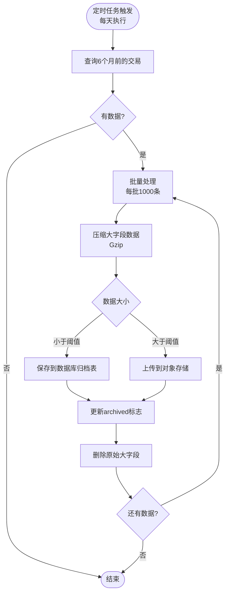
```mermaid
flowchart TD
    Start([定时任务触发<br/>每天执行]) --> Query[查询6个月前的交易]
    Query --> HasData{有数据?}
    
    HasData -->|否| End([结束])
    HasData -->|是| Batch[批量处理<br/>每批1000条]
    
    Batch --> Compress[压缩大字段数据<br/>Gzip]
    Compress --> CheckSize{数据大小}
    
    CheckSize -->|小于阈值| SaveDB[保存到数据库归档表]
    CheckSize -->|大于阈值| UploadStorage[上传到对象存储]
    
    SaveDB --> UpdateFlag[更新archived标志]
    UploadStorage --> UpdateFlag
    
    UpdateFlag --> DeleteOriginal[删除原始大字段]
    DeleteOriginal --> NextBatch{还有数据?}
    
    NextBatch -->|是| Batch
    NextBatch -->|否| End
```

### API请求处理流程

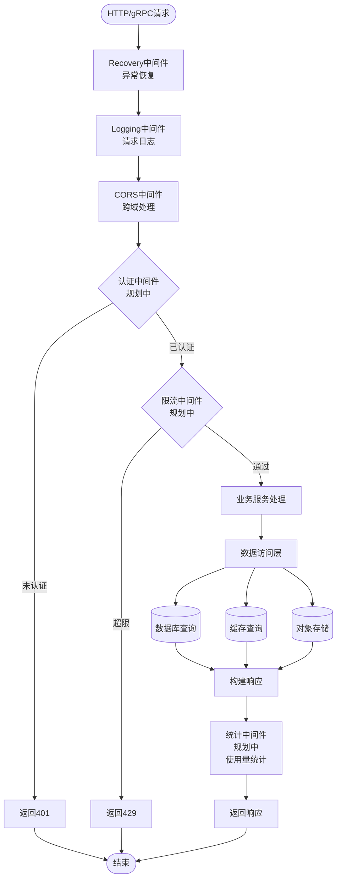
```mermaid
flowchart TD
    Start([HTTP/gRPC请求]) --> Recovery[Recovery中间件<br/>异常恢复]
    Recovery --> Logging[Logging中间件<br/>请求日志]
    Logging --> CORS[CORS中间件<br/>跨域处理]
    
    CORS --> Auth{认证中间件<br/>规划中}
    Auth -->|未认证| AuthError[返回401]
    Auth -->|已认证| RateLimit{限流中间件<br/>规划中}
    
    RateLimit -->|超限| RateLimitError[返回429]
    RateLimit -->|通过| Business[业务服务处理]
    
    Business --> DataAccess[数据访问层]
    DataAccess --> DB[(数据库查询)]
    DataAccess --> Cache[(缓存查询)]
    DataAccess --> Storage[(对象存储)]
    
    DB --> Response[构建响应]
    Cache --> Response
    Storage --> Response
    
    Response --> Stats[统计中间件<br/>规划中<br/>使用量统计]
    Stats --> Return[返回响应]
    
    AuthError --> End([结束])
    RateLimitError --> End
    Return --> End
```

---

## API管理流程图

### Token认证流程（规划中）

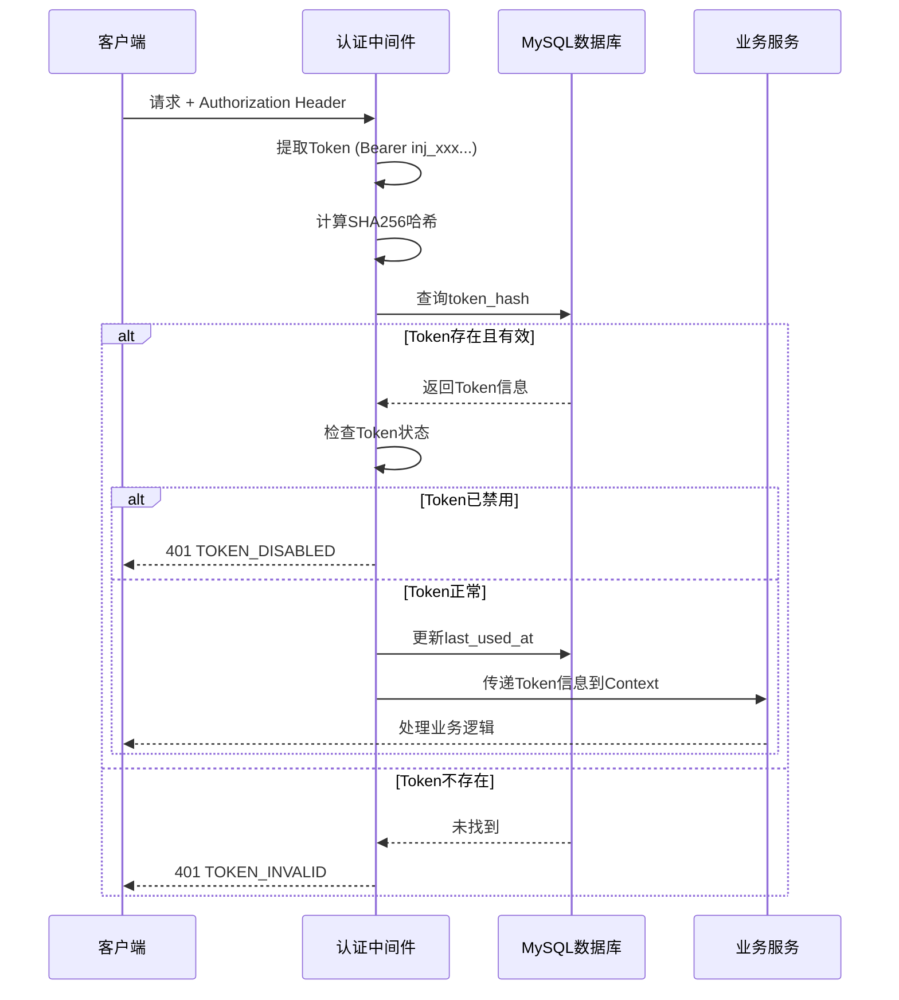
```mermaid
sequenceDiagram
    participant Client as 客户端
    participant Middleware as 认证中间件
    participant DB as MySQL数据库
    participant Service as 业务服务

    Client->>Middleware: 请求 + Authorization Header
    Middleware->>Middleware: 提取Token (Bearer inj_xxx...)
    Middleware->>Middleware: 计算SHA256哈希
    
    Middleware->>DB: 查询token_hash
    alt Token存在且有效
        DB-->>Middleware: 返回Token信息
        Middleware->>Middleware: 检查Token状态
        alt Token已禁用
            Middleware-->>Client: 401 TOKEN_DISABLED
        else Token正常
            Middleware->>DB: 更新last_used_at
            Middleware->>Service: 传递Token信息到Context
            Service-->>Client: 处理业务逻辑
        end
    else Token不存在
        DB-->>Middleware: 未找到
        Middleware-->>Client: 401 TOKEN_INVALID
    end
```

### 限流检查流程（规划中）

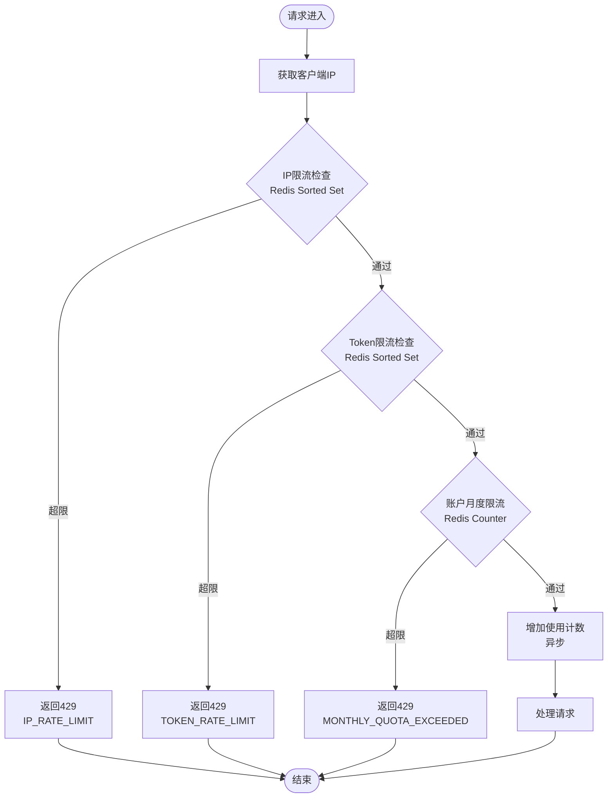
```mermaid
flowchart TD
    Start([请求进入]) --> GetIP[获取客户端IP]
    GetIP --> IPLimit{IP限流检查<br/>Redis Sorted Set}
    
    IPLimit -->|超限| IPError[返回429<br/>IP_RATE_LIMIT]
    IPLimit -->|通过| TokenLimit{Token限流检查<br/>Redis Sorted Set}
    
    TokenLimit -->|超限| TokenError[返回429<br/>TOKEN_RATE_LIMIT]
    TokenLimit -->|通过| UserLimit{账户月度限流<br/>Redis Counter}
    
    UserLimit -->|超限| UserError[返回429<br/>MONTHLY_QUOTA_EXCEEDED]
    UserLimit -->|通过| Increment[增加使用计数<br/>异步]
    Increment --> Process[处理请求]
    
    IPError --> End([结束])
    TokenError --> End
    UserError --> End
    Process --> End
```

### 使用量统计流程（规划中）

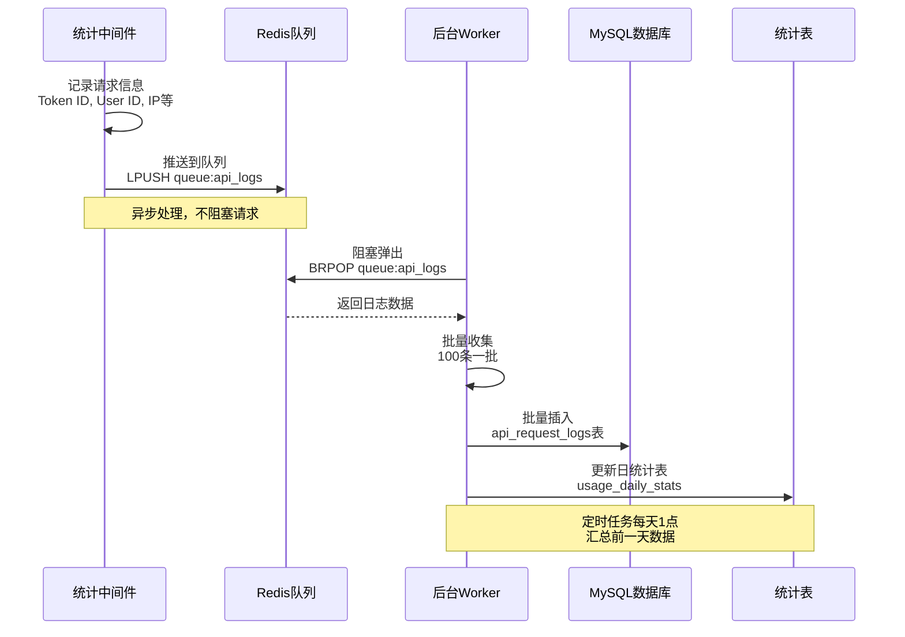
```mermaid
sequenceDiagram
    participant Middleware as 统计中间件
    participant Redis as Redis队列
    participant Worker as 后台Worker
    participant DB as MySQL数据库
    participant Stats as 统计表

    Middleware->>Middleware: 记录请求信息<br/>Token ID, User ID, IP等
    Middleware->>Redis: 推送到队列<br/>LPUSH queue:api_logs
    
    Note over Middleware,Redis: 异步处理，不阻塞请求
    
    Worker->>Redis: 阻塞弹出<br/>BRPOP queue:api_logs
    Redis-->>Worker: 返回日志数据
    
    Worker->>Worker: 批量收集<br/>100条一批
    Worker->>DB: 批量插入<br/>api_request_logs表
    
    Worker->>Stats: 更新日统计表<br/>usage_daily_stats
    
    Note over Worker,Stats: 定时任务每天1点<br/>汇总前一天数据
```

---

## 部署架构图

### Docker Compose部署

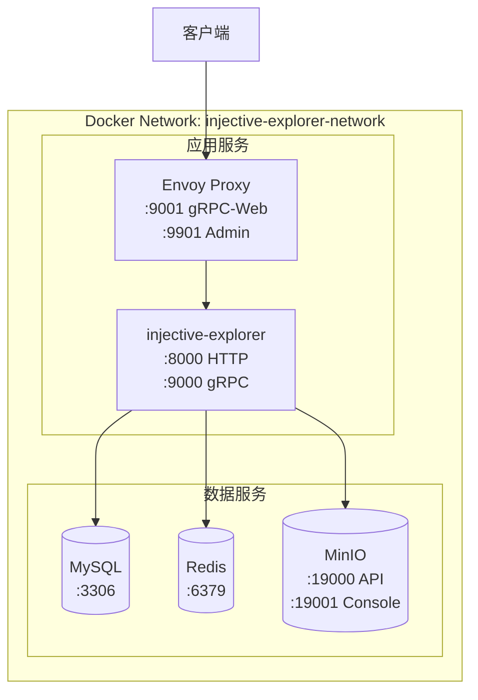
```mermaid
graph TB
    subgraph "Docker Network: injective-explorer-network"
        subgraph "应用服务"
            App[injective-explorer<br/>:8000 HTTP<br/>:9000 gRPC]
            Envoy[Envoy Proxy<br/>:9001 gRPC-Web<br/>:9901 Admin]
        end
        
        subgraph "数据服务"
            MySQL[(MySQL<br/>:3306)]
            Redis[(Redis<br/>:6379)]
            MinIO[(MinIO<br/>:19000 API<br/>:19001 Console)]
        end
    end
    
    Client[客户端] --> Envoy
    Envoy --> App
    App --> MySQL
    App --> Redis
    App --> MinIO
```

### 生产环境部署

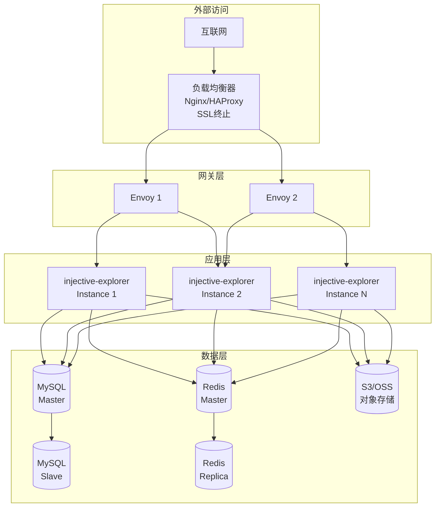
```mermaid
graph TB
    subgraph "外部访问"
        Internet[互联网]
        LB[负载均衡器<br/>Nginx/HAProxy<br/>SSL终止]
    end
    
    subgraph "网关层"
        Envoy1[Envoy 1]
        Envoy2[Envoy 2]
    end
    
    subgraph "应用层"
        App1[injective-explorer<br/>Instance 1]
        App2[injective-explorer<br/>Instance 2]
        App3[injective-explorer<br/>Instance N]
    end
    
    subgraph "数据层"
        MySQL_Master[(MySQL<br/>Master)]
        MySQL_Slave[(MySQL<br/>Slave)]
        Redis_Master[(Redis<br/>Master)]
        Redis_Slave[(Redis<br/>Replica)]
        S3[(S3/OSS<br/>对象存储)]
    end
    
    Internet --> LB
    LB --> Envoy1
    LB --> Envoy2
    
    Envoy1 --> App1
    Envoy1 --> App2
    Envoy2 --> App2
    Envoy2 --> App3
    
    App1 --> MySQL_Master
    App2 --> MySQL_Master
    App3 --> MySQL_Master
    
    MySQL_Master --> MySQL_Slave
    
    App1 --> Redis_Master
    App2 --> Redis_Master
    App3 --> Redis_Master
    
    Redis_Master --> Redis_Slave
    
    App1 --> S3
    App2 --> S3
    App3 --> S3
```

### 服务依赖关系

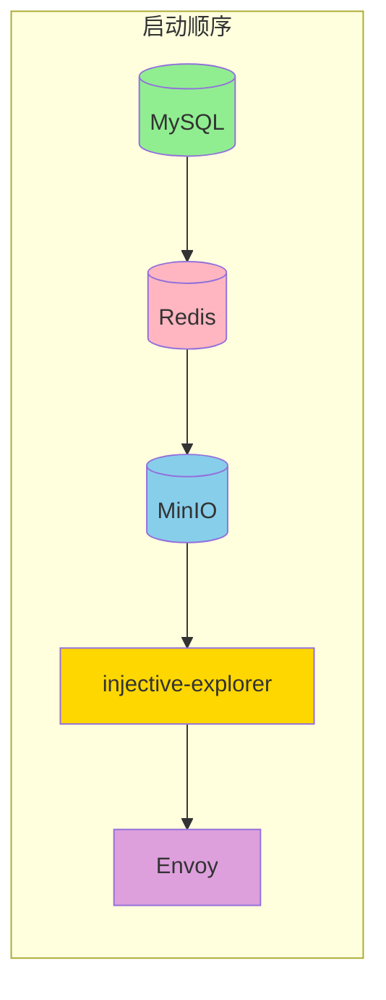
```mermaid
graph LR
    subgraph "启动顺序"
        MySQL[(MySQL)] --> Redis[(Redis)]
        Redis --> MinIO[(MinIO)]
        MinIO --> App[injective-explorer]
        App --> Envoy[Envoy]
    end
    
    style MySQL fill:#90EE90
    style Redis fill:#FFB6C1
    style MinIO fill:#87CEEB
    style App fill:#FFD700
    style Envoy fill:#DDA0DD
```

---

## 数据模型关系图

### 核心数据模型

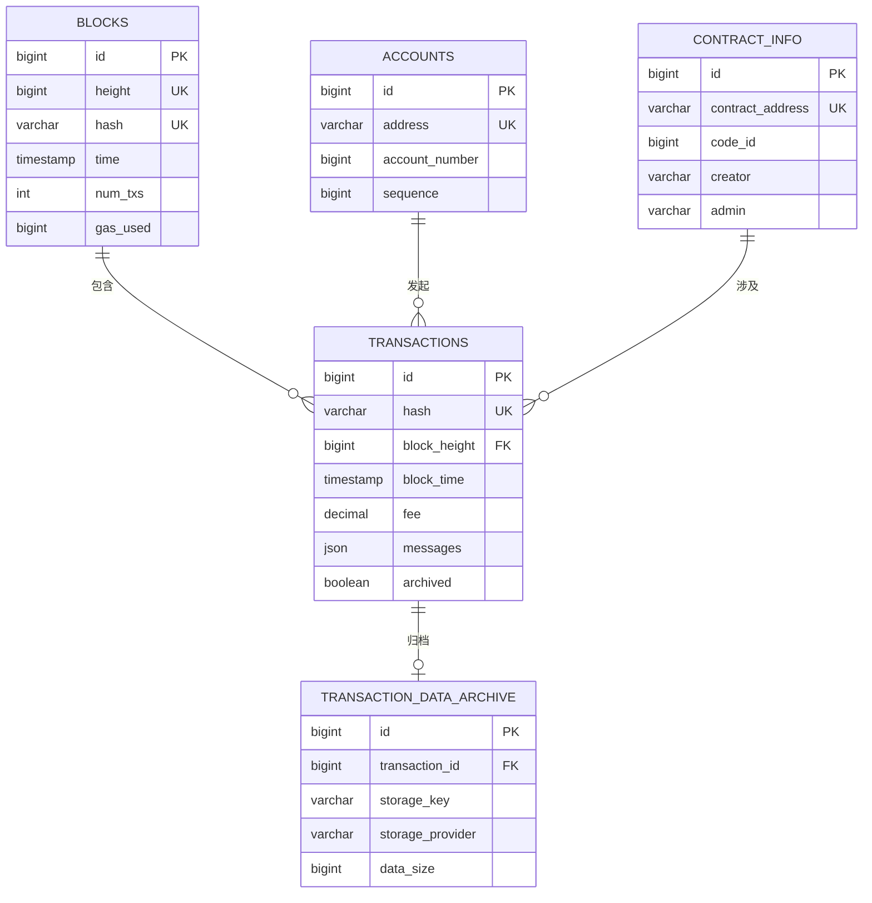
```mermaid
erDiagram
    BLOCKS ||--o{ TRANSACTIONS : "包含"
    TRANSACTIONS ||--o| TRANSACTION_DATA_ARCHIVE : "归档"
    ACCOUNTS ||--o{ TRANSACTIONS : "发起"
    CONTRACT_INFO ||--o{ TRANSACTIONS : "涉及"
    
    BLOCKS {
        bigint id PK
        bigint height UK
        varchar hash UK
        timestamp time
        int num_txs
        bigint gas_used
    }
    
    TRANSACTIONS {
        bigint id PK
        varchar hash UK
        bigint block_height FK
        timestamp block_time
        decimal fee
        json messages
        boolean archived
    }
    
    TRANSACTION_DATA_ARCHIVE {
        bigint id PK
        bigint transaction_id FK
        varchar storage_key
        varchar storage_provider
        bigint data_size
    }
    
    ACCOUNTS {
        bigint id PK
        varchar address UK
        bigint account_number
        bigint sequence
    }
    
    CONTRACT_INFO {
        bigint id PK
        varchar contract_address UK
        bigint code_id
        varchar creator
        varchar admin
    }
```

### API管理数据模型（规划中）

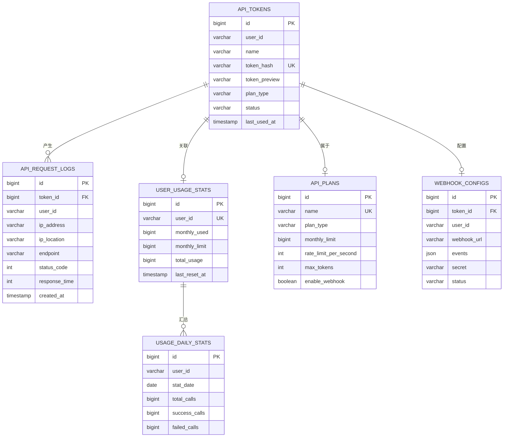
```mermaid
erDiagram
    API_TOKENS ||--o{ API_REQUEST_LOGS : "产生"
    API_TOKENS ||--o| USER_USAGE_STATS : "关联"
    USER_USAGE_STATS ||--o{ USAGE_DAILY_STATS : "汇总"
    API_TOKENS ||--o| API_PLANS : "属于"
    API_TOKENS ||--o| WEBHOOK_CONFIGS : "配置"
    
    API_TOKENS {
        bigint id PK
        varchar user_id
        varchar name
        varchar token_hash UK
        varchar token_preview
        varchar plan_type
        varchar status
        timestamp last_used_at
    }
    
    API_REQUEST_LOGS {
        bigint id PK
        bigint token_id FK
        varchar user_id
        varchar ip_address
        varchar ip_location
        varchar endpoint
        int status_code
        int response_time
        timestamp created_at
    }
    
    USER_USAGE_STATS {
        bigint id PK
        varchar user_id UK
        bigint monthly_used
        bigint monthly_limit
        bigint total_usage
        timestamp last_reset_at
    }
    
    USAGE_DAILY_STATS {
        bigint id PK
        varchar user_id
        date stat_date
        bigint total_calls
        bigint success_calls
        bigint failed_calls
    }
    
    API_PLANS {
        bigint id PK
        varchar name UK
        varchar plan_type
        bigint monthly_limit
        int rate_limit_per_second
        int max_tokens
        boolean enable_webhook
    }
    
    WEBHOOK_CONFIGS {
        bigint id PK
        bigint token_id FK
        varchar user_id
        varchar webhook_url
        json events
        varchar secret
        varchar status
    }
```

---

## 总结

本文档使用Mermaid语法绘制了系统的各种架构图和流程图，包括：

1. **系统架构图**: 展示整体系统结构和组件关系
2. **数据流图**: 展示关键业务流程的数据流转
3. **核心流程图**: 展示区块同步、数据归档、API处理等核心流程
4. **API管理流程图**: 展示规划中的API管理功能流程
5. **部署架构图**: 展示开发和生产环境的部署架构
6. **数据模型关系图**: 展示数据库表之间的关系

这些图表可以帮助开发团队和运维团队更好地理解系统架构和业务流程。

---

**文档结束**

